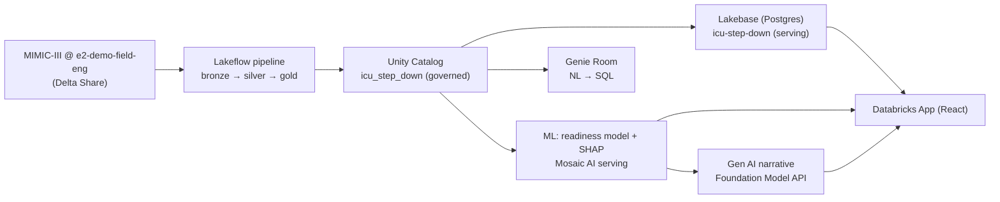

# ICU Step-Down Readiness

An end-to-end Databricks data journey that helps ICU clinicians identify which patients are ready to be **safely stepped down** from intensive care — freeing scarce ICU beds while protecting patients from premature transfer.

**Live app:** https://icu-step-down-7474646035095173.aws.databricksapps.com

> Built for the FE Tech Bar. Data is the **publicly available, de-identified MIMIC-III** research dataset (Delta-shared into the workspace). No real/identifiable patient data is committed to this repo — only aggregate counts, metrics, and small samples as run evidence.

---

## The business problem

ICUs run at 70–90% occupancy; a single blocked bed can delay a critical admission. Step-down decisions today are manual, subjective, and vary by provider and shift, so clinicians tend to hold patients longer than necessary "to be safe."

**The value:** a tool that prioritizes which ICU patients are most ready to step down in the next 24–48h.
- **Operational:** target 10–15% reduction in ICU length of stay.
- **Financial:** ~$2,000–5,000 saved per accelerated discharge-day.
- **Capacity:** more ICU beds available for emergent admissions.
- **Clinical:** more consistent, evidence-informed step-down decisions.

This is positioned as **clinical decision support / prioritization**, not automated triage (see [Model honesty](#model-honesty)).

---

## The end-to-end journey



| Stage | Tool | What it does | Evidence |
|-------|------|--------------|----------|
| Ingest | Lakeflow declarative pipeline | Delta-shared MIMIC-III → medallion `bronze`/`silver`/`gold` | [02-bronze](evidence/02-bronze.md) · [02-silver](evidence/02-silver.md) · [02-gold](evidence/02-gold.md) |
| Govern | Unity Catalog | Catalog/schema comments, PII classification tags, grants, lineage | [03-governance](evidence/03-governance.md) |
| Serve | Lakebase (Postgres) | SNAPSHOT synced tables for low-latency operational reads | [04-lakebase](evidence/04-lakebase.md) |
| Intelligence | LightGBM + SHAP, Mosaic AI + FM API | Readiness ranking model + per-patient factors + clinical narrative | [05-ml-metrics](evidence/05-ml-metrics.md) · [05-serving](evidence/05-serving.md) · [05-genai-narrative](evidence/05-genai-narrative.md) |
| NL query | Genie Room | Natural-language questions over the gold/silver tables | [06-genie](evidence/06-genie.md) |
| Surface | Databricks App (React + FastAPI) | Census dashboard, patient detail, analytics | [07-app-api](evidence/07-app-api.md) · [07-app-deploy](evidence/07-app-deploy.md) |
| Provision | FEVM + DABs | AWS serverless sandbox; all assets via Asset Bundles | [00-provisioning](evidence/00-provisioning.md) |
| Data access | Delta Sharing | Cross-metastore D2D share of the source | [01-data-access](evidence/01-data-access.md) |
| Tests | pytest + vitest | 117 backend + 32 frontend + 17 pipeline integration | [08-tests](evidence/08-tests.md) |

All evidence files contain **committed, text-readable run output** (row counts, query results, model metrics, deploy logs) — not screenshots.

---

## Repository layout

```
├── databricks.yml            # DAB bundle (sandbox target)
├── resources/                # DAB resources (pipeline, model serving, app)
├── src/
│   ├── pipelines/            # bronze.sql / silver.sql / gold.sql (Lakeflow)
│   ├── ml/                   # training, SHAP, pyfunc model, registration
│   ├── genai/                # Foundation Model API clinical narrative
│   ├── governance/           # Unity Catalog comments / tags / grants
│   ├── lakebase/             # Lakebase instance + synced tables
│   └── genie/                # Genie space config + example questions
├── app/                      # Databricks App (FastAPI backend + React/apx frontend)
├── tests/integration/        # data-pipeline integration tests (medallion invariants)
├── evidence/                 # committed run evidence per stage
├── instructions/             # the build brief and source-data/spec docs
├── docs/superpowers/         # design spec + implementation plan
└── deck/                     # business presentation deck
```

## Data model

- **UC catalog `icu_step_down`** — `bronze` (raw shared tables), `silver` (typed/cleaned: patients, icu_stays, vital_signs, lab_events), `gold` (`patient_features`, `readiness_training_set`, `census`), `ml` (registered model).
- **Lakebase `icu-step-down`** (Postgres) — `census`, `patient_features`, `census_vitals` synced for the app.
- Source: `hls_healthcare.mimic_iii` (46,520 patients / 61,532 ICU stays), Delta-shared read-only as `mimic_iii_src`.

## Running / deploying

Everything is deployed through Databricks Asset Bundles against the sandbox (CLI profile `icu-sandbox`):

```bash
databricks bundle validate -t sandbox --profile icu-sandbox
databricks bundle deploy   -t sandbox --profile icu-sandbox   # pipeline, model serving, app
```

- **Pipeline:** run the `icu-step-down-readiness-medallion` Lakeflow pipeline to (re)build bronze→silver→gold.
- **Lakebase sync:** `python src/lakebase/sync_tables.py` (idempotent).
- **Tests:** `cd app && uv run pytest` (backend, 117) · `cd app && bunx vitest run` (frontend, 32) · `pytest tests/integration -m integration` (pipeline, 17 — needs the `icu-sandbox` profile + `databricks-sql-connector`).

## Model honesty

The readiness model (LightGBM on 24h vital/lab/status features) predicts safe step-down (no ICU readmission within 72h). It is intentionally framed as a **relative ranking / decision-support** tool:

- **AUC ≈ 0.66** — modest discrimination given the retrospective feature set.
- Bounce-back **PR-AUC ≈ 0.06** (~2× the 3% base rate). The majority-class PR-AUC (~0.98) is **not** a meaningful quality metric and is labeled as misleading in the app.
- The app shows a **relative readiness index (0–100, percentile within the current census)** and Ready/Borderline/Not-ready bands — **never** a calibrated "probability of safe discharge."
- SHAP factors are mapped to clinical labels; known-risk features (on vasopressors/ventilator) are always presented as risks.

## Presentation deck

See [`deck/`](deck/) — a business-outcome-led deck for the executive sponsor and the clinical/technical owner.
