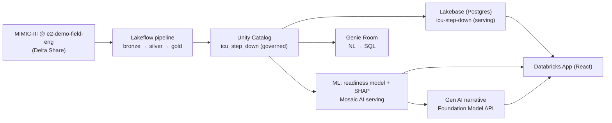

# ICU Step-Down Readiness

An end-to-end Databricks data journey that helps ICU clinicians identify which patients are ready to be **safely stepped down** from intensive care — freeing scarce ICU beds while protecting patients from premature transfer.

**Live app:** https://icu-step-down-7474645692590282.aws.databricksapps.com

> Built for the FE Tech Bar. Data is the **publicly available, de-identified MIMIC-III** research dataset (Delta-shared into the workspace). No real/identifiable patient data is committed to this repo — only aggregate counts, metrics, and small samples as run evidence.

---

## ✅ Proof this build actually ran (readable execution evidence)

Committed run output lives in three places: the top-level **[`logs/`](logs/)** folder
(multi-format — `.log`, `.csv`, `.json`, `.md`, and a **[notebook with cell outputs](logs/execution-evidence.ipynb)**),
the narrative **[`EVIDENCE.md`](EVIDENCE.md)**, and the raw **[`evidence/raw/`](evidence/raw/)** captures.
Headline results, as committed text:

- **Lakeflow pipeline run — COMPLETED**, bronze→gold row counts: bronze `admissions 58,976` / `chart_events 38,776,289` / `lab_events 27,854,055` → gold `patient_features 61,532`, `readiness_training_set 61,532`, `census 40`. ([`evidence/raw/pipeline-run.txt`](evidence/raw/pipeline-run.txt))
- **Query against governed gold tables:** census cohort n=40, avg LOS 2.83d, 8 on pressors / 11 on vent; training label balance 59,706 ready / 1,826 not-ready. ([`evidence/raw/gold-queries.txt`](evidence/raw/gold-queries.txt))
- **Real served prediction** (Mosaic AI `icu-readiness`, model v2): `readiness_score 0.4739` with factors `lactate_last (risk 0.262)`, `on_ventilator (risk 0.030)`, … — `on_ventilator` shown as **risk** (safety override, live). ([`evidence/raw/serving-prediction.txt`](evidence/raw/serving-prediction.txt))
- **Genie Q&A** over the governed tables: *"How many current ICU patients are ready for step-down?"* → generated SQL → `ready=38, not_ready=2, total=40`. ([`evidence/raw/genie-qa.txt`](evidence/raw/genie-qa.txt))
- **Deployed app RUNNING** + Lakebase synced tables ONLINE; **drift job** PSI 2.15 / KS 0.22; **unit-access** scoped predicate returns 15 MICU rows live. ([`evidence/raw/app-deploy.txt`](evidence/raw/app-deploy.txt), [`evidence/raw/drift-run.txt`](evidence/raw/drift-run.txt), [`evidence/raw/unit-access-verification.txt`](evidence/raw/unit-access-verification.txt))
- **Test suites passing:** 188 backend + 36 frontend + 18 monitoring/genai = **242 passing** (+17 live integration) — committed run output in [`logs/test-run.log`](logs/test-run.log).

**Want the transformation logic end to end?** The full bronze→silver→gold medallion SQL and the Genie space configuration are reproduced readably in **[`DATA-JOURNEY.md`](DATA-JOURNEY.md)** (source in [`src/pipelines/`](src/pipelines/) and [`src/genie/`](src/genie/)).

### For reviewers — submission map

| Requirement | Where |
|-------------|-------|
| **README** — what it does + how to run | this file (below) |
| **BUILD.md** — workflow, AI tools/prompts, decisions, where AI was used | [`BUILD.md`](BUILD.md) |
| **Execution evidence** — run outputs, notebook w/ outputs, test run | [`logs/`](logs/) (`.log`/`.csv`/`.json`/`.md`/`.ipynb`), [`EVIDENCE.md`](EVIDENCE.md), [`evidence/raw/`](evidence/raw/) |
| **Architecture diagram** | [`evidence/architecture.md`](evidence/architecture.md) (Mermaid text — always collected) + [`evidence/architecture.png`](evidence/architecture.png) (rendered image) |
| **Screenshots** (app / analytics / patient detail) | `evidence/screenshot-*.png` — **binary; attach separately** (repo collector excludes binaries) |
| **Presentation** | [`deck/icu-step-down-readiness.pdf`](deck/icu-step-down-readiness.pdf) — **attach the PDF separately** (HTML alone not accepted; binaries excluded from repo scan) |
| **Demo recording link** | [`evidence/RECORDING.md`](evidence/RECORDING.md) — _submitter adds link_ |
| **Data safety** | public de-identified MIMIC-III; no secrets (pre-commit scan); synthetic `care_unit` |

---

## The business problem

ICUs run at 70–90% occupancy; a single blocked bed can delay a critical admission. Step-down decisions today are manual, subjective, and vary by provider and shift, so clinicians tend to hold patients longer than necessary "to be safe."

**The value:** a tool that prioritizes which ICU patients are most ready to step down in the next 24–48h.
- **Operational:** target 10–15% reduction in ICU length of stay.
- **Financial:** ~$2,000–5,000 saved per accelerated discharge-day.
- **Capacity:** more ICU beds available for emergent admissions.
- **Clinical:** more consistent, evidence-informed step-down decisions.

This is positioned as **clinical decision support / prioritization**, not automated triage (see [Model honesty](#model-honesty)).

---

## The end-to-end journey


```mermaid
flowchart LR
    A["MIMIC-III @ e2-demo-field-eng<br/>(Delta Share)"] --> B["Lakeflow pipeline<br/>bronze → silver → gold"]
    B --> C["Unity Catalog<br/>icu_step_down (governed)"]
    C --> D["Lakebase (Postgres)<br/>icu-step-down (serving)"]
    C --> E["ML: readiness model + SHAP<br/>Mosaic AI serving"]
    E --> F["Gen AI narrative<br/>Foundation Model API"]
    C --> G["Genie Room<br/>NL → SQL"]
    D --> H["Databricks App (React)"]
    E --> H
    F --> H
```

| Stage | Tool | What it does | Evidence |
|-------|------|--------------|----------|
| Ingest | Lakeflow declarative pipeline | Delta-shared MIMIC-III → medallion `bronze`/`silver`/`gold` | [02-bronze](evidence/02-bronze.md) · [02-silver](evidence/02-silver.md) · [02-gold](evidence/02-gold.md) |
| Govern | Unity Catalog | Catalog/schema comments, PII classification tags, grants, lineage | [03-governance](evidence/03-governance.md) |
| Serve | Lakebase (Postgres) | SNAPSHOT synced tables for low-latency operational reads | [04-lakebase](evidence/04-lakebase.md) |
| Intelligence | LightGBM + SHAP, Mosaic AI + FM API | Readiness ranking model + per-patient factors + clinical narrative | [05-ml-metrics](evidence/05-ml-metrics.md) · [05-serving](evidence/05-serving.md) · [05-genai-narrative](evidence/05-genai-narrative.md) |
| NL query | Genie Room | Natural-language questions over the gold/silver tables | [06-genie](evidence/06-genie.md) |
| Surface | Databricks App (React + FastAPI) | Census dashboard, patient detail, analytics | [07-app-api](evidence/07-app-api.md) · [07-app-deploy](evidence/07-app-deploy.md) |
| Provision | FEVM + DABs | AWS serverless sandbox; all assets via Asset Bundles | [00-provisioning](evidence/00-provisioning.md) |
| Data access | Delta Sharing | Cross-metastore D2D share of the source | [01-data-access](evidence/01-data-access.md) |
| Tests | pytest + vitest | 188 backend + 36 frontend + 18 monitoring/genai (+17 live integration) — run output in [`logs/test-run.log`](logs/test-run.log) | [08-tests](evidence/08-tests.md) |

All evidence files contain **committed, text-readable run output** (row counts, query results, model metrics, deploy logs) — not screenshots.

### ▶ Raw execution evidence (live-captured)

The [`evidence/raw/`](evidence/raw/) directory holds **verbatim CLI/API output** from live runs against the sandbox (captured 2026-09-25) — proof the build actually executed, not transcribed summaries:

- [`evidence/raw/gold-queries.txt`](evidence/raw/gold-queries.txt) — live SQL results against the governed `icu_step_down.gold.*` tables
- [`evidence/raw/serving-prediction.txt`](evidence/raw/serving-prediction.txt) — real request/response from the `icu-readiness` Mosaic AI endpoint (`readiness_score` + SHAP factors)
- [`evidence/raw/genie-qa.txt`](evidence/raw/genie-qa.txt) — five NL questions → generated SQL → result rows via the Genie Conversation API
- [`evidence/raw/pipeline-run.txt`](evidence/raw/pipeline-run.txt) — Lakeflow pipeline run event log + bronze→silver→gold row counts
- [`evidence/raw/lakebase-query.txt`](evidence/raw/lakebase-query.txt) — Lakebase synced tables ONLINE + row counts read from Postgres
- [`evidence/raw/app-deploy.txt`](evidence/raw/app-deploy.txt) — Databricks App RUNNING + startup logs

Clinical-enhancement evidence (captured 2026-09-26):

- [`evidence/raw/gold-derived-signals.txt`](evidence/raw/gold-derived-signals.txt) — prevalence of the derived guardrail signals `recent_extubation` / `active_bleeding` across the cohort and current census
- [`evidence/raw/care-unit-distribution.txt`](evidence/raw/care-unit-distribution.txt) — synthetic `care_unit` (MICU/SICU/CCU) distribution over census and full cohort
- [`evidence/raw/drift-run.txt`](evidence/raw/drift-run.txt) — live drift job run: PSI 2.15 / KS 0.22 (verdict `drift`) vs the training baseline
- [`evidence/raw/drift-baseline.txt`](evidence/raw/drift-baseline.txt) — training-cohort score-decile baseline the drift check compares against
- [`evidence/raw/unit-access-verification.txt`](evidence/raw/unit-access-verification.txt) — live read-only proof of the unit-access mechanism (captured 2026-09-27): group resolution via `current_user.me()`, `care_unit` on gold + the Lakebase read path, the scoped predicate, and the fail-closed governed view

See [`evidence/raw/README.md`](evidence/raw/README.md) for the capture method and how to reproduce.

---

## Repository layout

```
├── databricks.yml            # DAB bundle (sandbox target)
├── resources/                # DAB resources (pipeline, model serving, app)
├── src/
│   ├── pipelines/            # bronze.sql / silver.sql / gold.sql (Lakeflow)
│   ├── ml/                   # training, SHAP, pyfunc model, registration
│   ├── genai/                # Foundation Model API clinical narrative
│   ├── governance/           # Unity Catalog comments / tags / grants
│   ├── lakebase/             # Lakebase instance + synced tables
│   └── genie/                # Genie space config + example questions
├── app/                      # Databricks App (FastAPI backend + React/apx frontend)
├── tests/integration/        # data-pipeline integration tests (medallion invariants)
├── evidence/                 # committed run evidence per stage
├── instructions/             # the build brief and source-data/spec docs
├── docs/superpowers/         # design spec + implementation plan
└── deck/                     # business presentation deck
```

## Data model

- **UC catalog `icu_step_down`** — `bronze` (raw shared tables), `silver` (typed/cleaned: patients, icu_stays, vital_signs, lab_events), `gold` (`patient_features`, `readiness_training_set`, `census`), `ml` (registered model).
- **Lakebase `icu-step-down`** (Postgres) — `census`, `patient_features`, `census_vitals` synced for the app.
- Source: `hls_healthcare.mimic_iii` (46,520 patients / 61,532 ICU stays), Delta-shared read-only as `mimic_iii_src`.

## Running / deploying

Everything is deployed through Databricks Asset Bundles against the sandbox (CLI profile `icu-sandbox`):

```bash
databricks bundle validate -t sandbox --profile icu-sandbox
databricks bundle deploy   -t sandbox --profile icu-sandbox   # pipeline, model serving, app
```

- **Pipeline:** run the `icu-step-down-readiness-medallion` Lakeflow pipeline to (re)build bronze→silver→gold.
- **Lakebase sync:** `python src/lakebase/sync_tables.py` (idempotent).
- **Tests:** `cd app && uv run pytest` (backend, **188**) · `cd app && bunx vitest run` (frontend, **36**) · `pytest tests/monitoring tests/genai` (monitoring/genai, **18**) · `pytest tests/integration -m integration` (pipeline, 17 — needs the `icu-sandbox` profile + `databricks-sql-connector`). Committed run output: [`logs/test-run.log`](logs/test-run.log).

## Governance

Unity Catalog governance (comments, PII tags, grants) is defined in [`src/governance/governance.sql`](src/governance/governance.sql). Unit-level row-access control — a fail-closed row filter on `census` and `patient_features` scoped to UC account groups `icu_admins`, `icu_micu`, `icu_sicu`, `icu_ccu` — is defined in [`src/governance/row_level_security.sql`](src/governance/row_level_security.sql). Both files must be re-run after any Lakeflow pipeline recreate because Materialized View metadata (comments, tags, and row-filter bindings) is lost on DROP/CREATE.

**Two enforcement layers, one care_unit mapping:**
The `rls_care_unit` row filter enforces per-care-team access for **direct Unity Catalog / SQL-warehouse access** to `gold.census` and `gold.patient_features`. The Databricks App reads **Lakebase-synced Postgres copies** (`mimic_iii.census`, `mimic_iii.patient_features`) using the app service principal (a member of `icu_admins`), which the UC row filter cannot reach — so app-side enforcement is applied separately.

**App-side per-team scoping (wired, config-gated):** The census, patient-detail, and analytics routes scope their Lakebase reads to the requesting user's `care_unit` groups. Enforcement is controlled by the `enforce_unit_access` config flag (env `<APP_SLUG>_ENFORCE_UNIT_ACCESS`), which **defaults to OFF** so the deployment's behaviour is unchanged until an operator enables it and verifies OBO group resolution live. When ON, the user's icu_* group memberships are read from the OBO `current_user.me()` result and mapped via `care_unit_filter_for_user` in [`app/src/icu_step_down/backend/lib/access.py`](app/src/icu_step_down/backend/lib/access.py) (icu_admins → all; icu_micu → MICU; etc.); a user in no recognised group is **denied all rows (fail-closed)**, and a request for a patient outside the user's units returns 404. The resolution and predicate helpers are unit-tested in `app/tests/lib/test_access.py`, the dependency's resolve/deny/undetermined branches in `app/tests/core/test_access_dependency.py`, and the route-level wiring in `app/tests/routers/test_unit_access_enforcement.py`.

Operational notes before enabling `enforce_unit_access` (verify live — the sandbox was IP-blocked at authoring time):

- **Determined-deny vs. undetermined:** a *resolved* user with no icu_* group sees an empty census (HTTP 200); if access **cannot be determined** (missing OBO token or a SCIM/`me()` failure) the request returns **HTTP 503**, never a silent empty dashboard — a transient auth failure must not be misread as "no patients in my unit."
- **Direct group membership only:** `current_user.me()` reports only *direct* memberships, so assign the icu_* groups to users directly (a nested/parent-group grant is not seen and would be denied).
- **Per-request cost:** each read makes one `current_user.me()` SCIM call (no caching) — fine at pilot scale; a short-TTL per-user scope cache is the documented follow-up before high traffic.
- **Viewer-dependent index:** with enforcement ON, the readiness index is a percentile *within the viewer's visible units* (scoping the cohort avoids reading denied units to rank a patient), so a scoped nurse and an admin may see different indices for the same patient. OFF (default) → whole-census index for everyone.

## Model honesty

The readiness model (LightGBM on 24h vital/lab/status features) predicts safe step-down (no ICU readmission within 72h). It is intentionally framed as a **relative ranking / decision-support** tool:

- **AUC ≈ 0.66** — modest discrimination given the retrospective feature set.
- Bounce-back **PR-AUC ≈ 0.06** (~2× the 3% base rate). The majority-class PR-AUC (~0.98) is **not** a meaningful quality metric and is labeled as misleading in the app.
- The app shows a **relative readiness index (0–100, percentile within the current census)** and Ready/Borderline/Not-ready bands — **never** a calibrated "probability of safe discharge."
- SHAP factors are mapped to clinical labels; known-risk features (on vasopressors/ventilator) are always presented as risks.

## Presentation deck

See [`deck/`](deck/) — a business-outcome-led deck for the executive sponsor and the clinical/technical owner.
