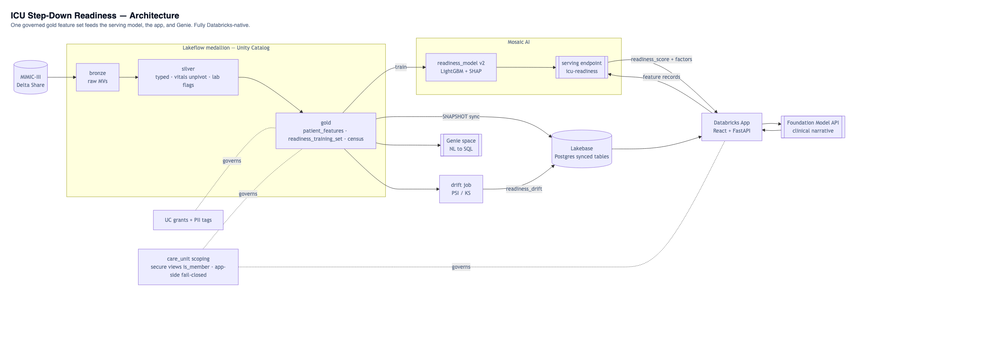
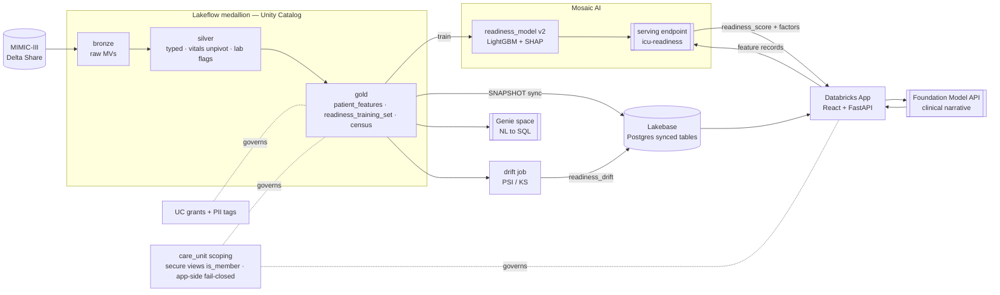

# Architecture — ICU Step-Down Readiness

End-to-end, fully Databricks-native journey. One governed gold feature set feeds
the model, the app, and Genie. Provided **both** as a rendered image
([`architecture.png`](architecture.png)) and as the **Mermaid text below** — the
repo collector excludes binary images, so the text version is the one guaranteed
to reach reviewers.

## Layer notes

- **bronze** — raw MIMIC-III tables as materialized views (Delta Share; no transform).
- **silver** — typed/cleaned; `chart_events` unpivoted to a long `vital_signs`
  stream (ITEMID→vital_name, °F→°C, physiologic range filters); `lab_events`
  `is_lactate` flag. See [`../DATA-JOURNEY.md`](../DATA-JOURNEY.md).
- **gold** — 24h feature engineering (`patient_features`) → `readiness_training_set`
  (+ 72h bounce-back label) and `census` (40 current); derived guardrail signals
  and synthetic `care_unit`.
- **serving** — LightGBM readiness model behind a Mosaic AI endpoint; returns a
  score + SHAP factors, with the always-flag-known-risks safety override.
- **narrative** — Foundation Model API turns score + factors into a clinician summary.
- **Genie** — three governed tables exposed for NL Q&A (see [`06-genie.md`](06-genie.md)).
- **Lakebase** — gold synced to Postgres (SNAPSHOT) for low-latency app reads.
- **app** — ranked census, patient detail, analytics; reads Lakebase + serving.
- **drift** — live vs training score distribution (PSI/KS) written back to gold, synced to Lakebase, surfaced in the app.
- **governance** — UC grants/PII tags + `care_unit` scoping (UC secure views via
  `is_member()`, and fail-closed app-side enforcement on the Lakebase path).
